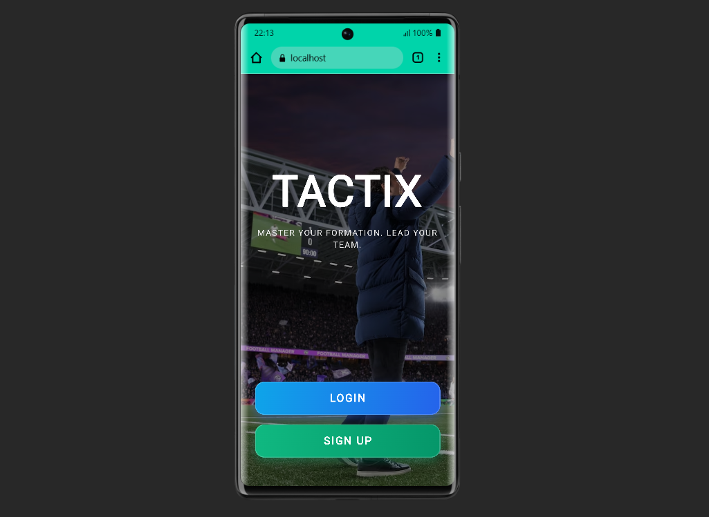
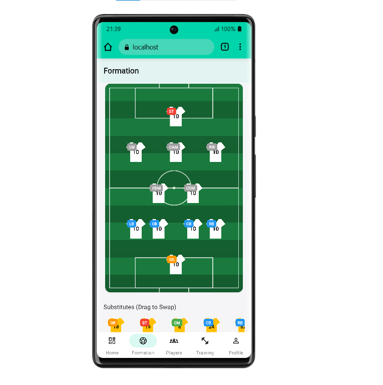

  
  
  <h1 style="font-size: 2.5rem; margin: 0; font-weight: 700; letter-spacing: 1px; color: #f8fafc;">
    TACTIX
  </h1>
  

    Professional Digital Playbook & Team Management Platform
  

 

  
  <!-- Section 1 -->
  

    <h2 style="color: #0f172a; margin-top: 0; border-bottom: 2px solid #e2e8f0; padding-bottom: 12px; font-weight: 600;">System Overview</h2>
    

      Tactix is a comprehensive management ecosystem engineered for sports organizations. By centralizing roster data, simplifying attendance tracking, and digitizing tactical planning, Tactix provides coaches and managers with an intuitive interface to optimize their team's performance. 
    

  

  <!-- Section 2 -->
  

    <h2 style="color: #0f172a; margin-top: 0; border-bottom: 2px solid #e2e8f0; padding-bottom: 12px; font-weight: 600;">Core Capabilities</h2>
    <ul style="color: #475569; line-height: 1.8;">
      <li><b>Roster Management:</b> Centralized player profiles and squad lists.</li>
      <li><b>Training & Attendance:</b> Streamlined scheduling and reporting.</li>
      <li><b>Smart Dashboard:</b> Key metrics and analytics visualized in real-time.</li>
    </ul>
  

 

<!-- Tactix Formations Spotlight -->

  <h2 style="color: #0f172a; margin-top: 0; font-weight: 600;">Tactical Formations Editor</h2>
  

    The integrated playbook allows technical staff to design, iterate, and save defensive and offensive structures dynamically. Quickly establish positioning using the interactive drag-and-drop board.
  

  

 

<!-- Architecture & Testing -->

  
  

    <h2 style="color: #0f172a; margin-top: 0; font-weight: 600;">Technical Stack</h2>
    
<b>Client:</b> Flutter (Cross-platform Mobile)

    
<b>Server:</b> Laravel 12 API (PHP 8.2)

  

  
  

    <h2 style="color: #166534; margin-top: 0; font-weight: 600;">Test The App</h2>
    
Use the following credentials to access the demo account and explore the application's features:

    

      <b>Email:</b> mouad@tactix.com 
      <b>Password:</b> password123
    

  

 

<!-- Getting Started -->

  <h2 style="color: #0f172a; margin-top: 0; font-weight: 600;">Installation & Setup</h2>
  
  

    

      <h3 style="color: #334155; font-size: 1rem; margin-bottom: 12px;">1. API Server (Laravel)</h3>
      <pre style="background: #1e293b; color: #e2e8f0; padding: 16px; border-radius: 6px; overflow-x: auto; font-size: 0.9rem; line-height: 1.5;"><code>cd back-end
composer install
cp .env.example .env
php artisan key:generate
php artisan migrate
php artisan serve</code></pre>
    

    

      <h3 style="color: #334155; font-size: 1rem; margin-bottom: 12px;">2. Mobile Client (Flutter)</h3>
      <pre style="background: #1e293b; color: #e2e8f0; padding: 16px; border-radius: 6px; overflow-x: auto; font-size: 0.9rem; line-height: 1.5;"><code>cd front-end
flutter pub get
flutter run</code></pre>
    

  

